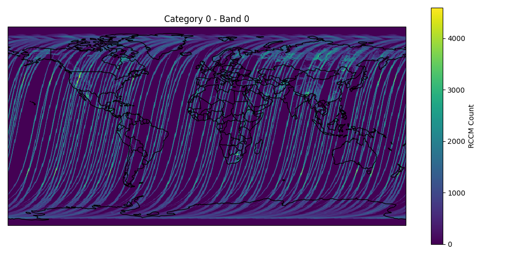

# HDF4 Processor  

## Overview  
**HDF4 Processor** is a Python tool designed for extracting, processing, and visualising satellite data stored in HDF4 format. It supports geospatial metadata parsing, dataset extraction, and mapping.  

## Features  
- Parses metadata from HDF4 XML files.  
- Reads dataset contents from HDF4 files.  
- Visualises geospatial data on a map.  
- Modular structure for easy maintenance and extension.  

## Installation  
Ensure you have Python installed, then install the required dependencies:  
```sh
pip install -r requirements.txt
```

## Usage
1. **Download the dataset and metadata files:**
Obtain the HDF4 dataset and corresponding XML metadata files from a reliable source. For instance, you can use data from NASA's [MISR Level 3 Data Browser](https://l0dup05.larc.nasa.gov/L3Web/view).

2. **Configure file paths:**
Edit the file paths for the metadata and dataset in `config.py` to match the location of the files you downloaded.

3. **Run the main script:**
```sh
python main.py
```
The script will parse metadata, extract the dataset, and generate a visualisation.

## Visualisation example
MISR RCCM category count dataset plot (Feb 2000):


